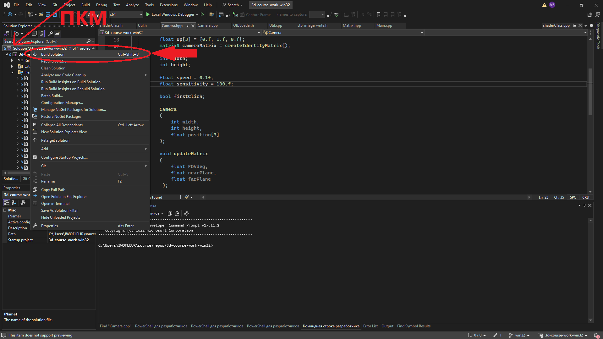

## Инструкция по первой настройке и запуску

⚠️ Важно: Проект готов к эксплуатации, но при первом билде необходимо вручную проверить корректность путей.

------------------------------
## 🚀 Последовательность действий
## 1. Подготовка файлов

* Клонируйте репозиторий:

```bash
git clone https://github.com/xpertdreamer/3d-course-work-linux.git
```

* Перейдите в рабочую директорию:

```bash
cd 3d-course-work-linux
```

* Переключитесь на нужную ветку:

```bash
git checkout win32
```

## 2. Настройка Visual Studio

* Откройте файл решения .sln.
* Настройте пути, ориентируясь на видео-инструкции:
   * Настройка окружения   — [Таймкод: 3:28](https://www.youtube.com/watch?v=XpBGwZNyUh0&list=PLPaoO-vpZnumdcb4tZc4x5Q-v7CkrQ6M-)
   * Подключение библиотек — [Таймкод: 0:50](https://www.youtube.com/watch?v=VRwhNKoxUtk)

📍 Важный нюанс по путям:
Указывайте папку 3d-course-work-linux/include для всех заголовочных файлов и библиотек, кроме imgui (она находится в 3d-course-work-linux/imgui).
## 3. Сборка и запуск

* Соберите решение через меню Visual Studio:



* Запускайте программу только через Git Bash:

```bash 
cd x64/Debug/
./3d-course-work-win32.exe
```
